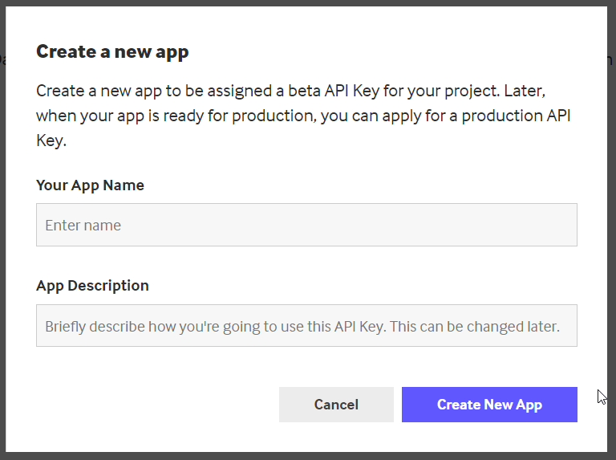
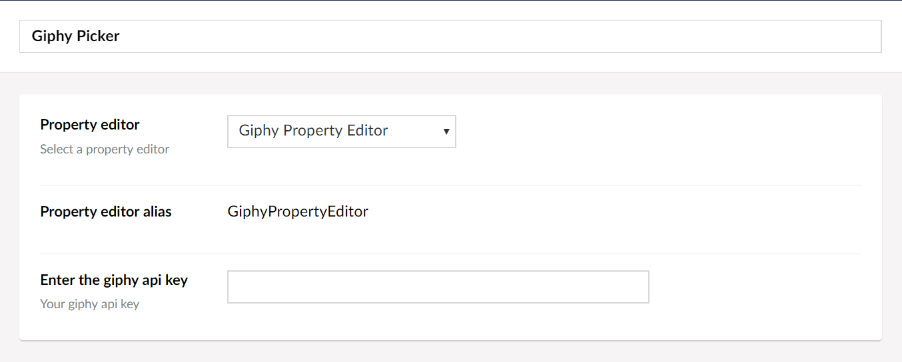

# Giphy Property Editor
A Giphy Property Editor for Umbraco by Paul Seal from [https://codeshare.co.uk](https://codeshare.co.uk)


[](https://ci.appveyor.com/project/prjseal/giphy-property-editor)

[](https://www.nuget.org/packages/GiphyPropertyEditor)

This property editor brings the giphy search to your umbraco backoffice


## Login details

<strong>Username:</strong> admin@admin.com
<strong>Password:</strong> 1234567890

## Dev instructions

To use it on your site, you will need to get an api key. Just go to [https://developers.giphy.com/](https://developers.giphy.com/) to register and get a key. It's quick and easy.



Then when you create a data type in Umbraco using the Giphy Property Editor, you just enter your api key in there or you can put it in the app settings like this:

```
<add key="giphyApiKey" value="your-giphy-api-key-here" />
```


